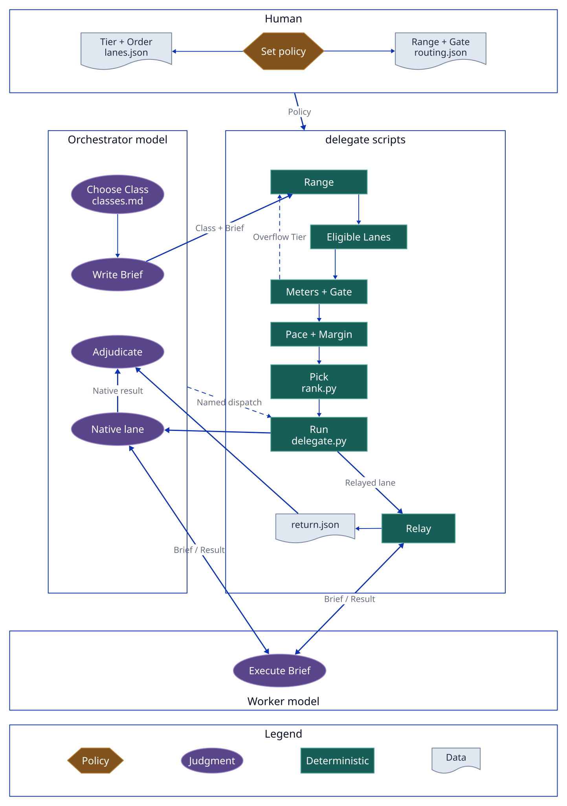

# delegate

Agent skills that route worker jobs to Claude Code, Codex, Antigravity (`agy`) or Grok
by task class, model capability and remaining subscription usage.

## How a job is routed

You set policy, the orchestrator model chooses a Class and writes a Brief, delegate's
scripts rank the Lanes and pick one, and a worker model runs the Brief. Terms are
defined in `CONTEXT.md`.

<picture>
  <source media="(prefers-color-scheme: dark)" srcset="docs/diagrams/routing-dark.svg">
  
</picture>

| Step | Owner | File |
| --- | --- | --- |
| Policy: Tier, Order, Range, Gate, Margin | Human | `lanes.json`, `routing.json` (global, or `.delegate/` per project) |
| Class and Brief | Orchestrator model | `assets/classes.md` |
| Range, Meters and Gate, Pace and Margin, Pick | Scripts | `scripts/rank.py` |
| Run, Relay, `return.json` | Scripts | `scripts/delegate.py`, `scripts/ads.sh` |
| Execute the Brief | Worker model | the Run's `prompt.md` |
| Adjudicate | Orchestrator model | `return.json`, or the native agent's final message |

Source: `docs/diagrams/routing.d2`; rebuild with `sh docs/diagrams/render.sh`.

## Install

Needs Python 3.9 or newer as `python3` (macOS ships 3.9 at `/usr/bin/python3`) and
`node` for relayed lanes. The scripts use the standard library only.

```sh
git clone https://github.com/halloffamer11/delegate ~/projects/delegate
make -C ~/projects/delegate install          # skills, Claude's courier agent, `delegate` command, codex home, relays
make -C ~/projects/delegate delegate-wizard  # write this machine's catalog
```

`install` links each skill as a directory symlink into `~/.claude/skills`,
`~/.agents/skills` and `~/.kiro/skills`. Set `HARNESS_SKILL_DIRS` in `local.mk` to
change that list. It also fetches the relays at their pinned commit (`ads.sh install`);
offline, it warns and finishes, and `sh agents/skills/delegate/scripts/ads.sh check`
says what is missing.

## Test

```sh
make test                   # with python3
make test PYTHON=python3.9  # with another interpreter
```

`make test` stops with a message when the interpreter is older than 3.9.
