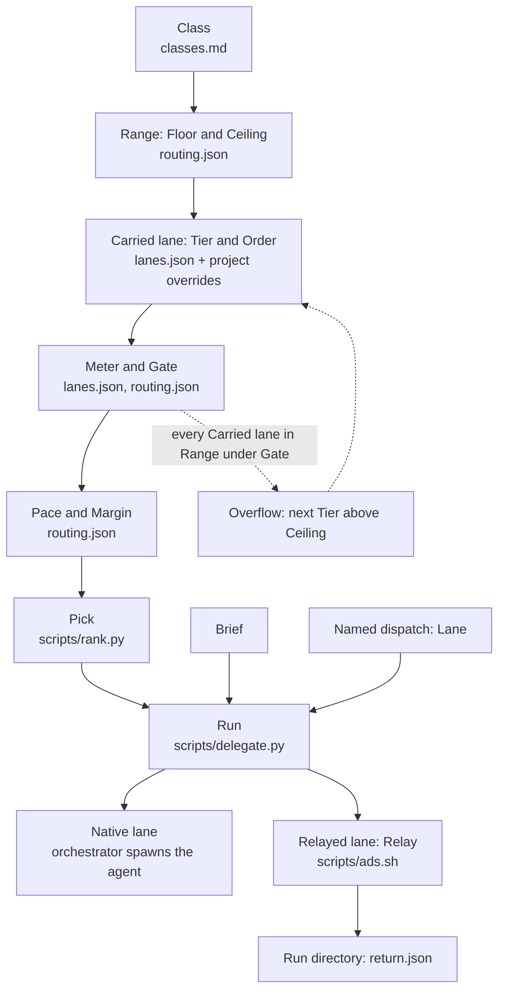

# delegate

Agent skills that route worker jobs to Claude Code, Codex, Antigravity (`agy`) or Grok
by task class, model capability and remaining subscription usage.

## How a job is routed

The orchestrator chooses a Class and writes a Brief; delegate selects a Pick and starts a Run.
`assets/` and `scripts/` paths are relative to `agents/skills/delegate/`. `routing.json` and `lanes.json` live in `~/.config/delegate/`; `classes.md` is `assets/classes.md`. A project overrides each in `.delegate/` at its git root. The table names the script that reads each one.



| Concept | Owning file / runtime input |
| --- | --- |
| Class | `assets/classes.md`; optional `~/.config/delegate/classes.md` and `.delegate/classes.md` overlays, read by `scripts/catalog.py`. |
| Floor, Ceiling, Range | `scripts/catalog.py` reads `~/.config/delegate/routing.json` and project `.delegate/routing.json`; shipped defaults: `assets/samples/routing.json`. `--tier` raises Floor within Range. |
| Lane, Carried lane, Tier, Order, Meter | `scripts/catalog.py` reads `~/.config/delegate/lanes.json`; starting catalog: `assets/samples/lanes.json`. Carried lane uses `enabled`; each Lane names its Meter. |
| Project tier | `scripts/catalog.py` reads `.delegate/lanes.json`; a changed Tier removes the Lane's global Order. |
| Project order | `scripts/catalog.py` reads `project_order` in `.delegate/routing.json` and applies it inside effective Tiers. |
| Meter, Pace | `scripts/usage.py` acquires readings and derives Pace; default cache: `~/.cache/delegate/usage.json`. |
| Gate, Margin, Overflow | `scripts/rank.py` reads effective `routing.json` policy. Overflow retries above Ceiling only when at least one Carried lane in Range fails Gate and every veto there is Gate or an absent Harness CLI; it never admits Tier 4. |
| Pick | `scripts/rank.py`: unknown Pace sorts last; then Tier, Order, descending Pace, Lane name. A later Lane takes the Pick when its Pace is at least the current Pick's Pace plus Margin. With meters off, Gate, Pace and Margin are bypassed. |
| Named dispatch | `scripts/delegate.py`: caller names the Lane, bypassing Range, Gate, Pace, Margin and Pick selection. |
| Brief, Run | `scripts/delegate.py` reads Brief and allocates a fresh Run directory before native/relayed execution; default: `~/.cache/delegate/runs/`. |
| Native lane, Relayed lane, Relay | `scripts/orchestrators.py` reads profiles (e.g. `assets/orchestrators/claude.json`). Native lane prints a spawn instruction for the orchestrator; Relayed lane uses the Relay pinned by `scripts/ads.sh`. |
| Run: `return.json` | `scripts/delegate.py` writes the relayed result using `assets/schemas/return.json`. Native lane returns its final message to the orchestrator; delegate does not write `return.json` for it. |

## Install

Needs Python 3.9 or newer as `python3` (macOS ships 3.9 at `/usr/bin/python3`) and
`node` for relayed lanes. The scripts use the standard library only.

```sh
git clone https://github.com/halloffamer11/delegate ~/projects/delegate
make -C ~/projects/delegate install          # skills, Claude's courier agent, `delegate` command, codex home
make -C ~/projects/delegate delegate-wizard  # write this machine's catalog
```

`install` links each skill as a directory symlink into `~/.claude/skills`,
`~/.agents/skills` and `~/.kiro/skills`. Set `HARNESS_SKILL_DIRS` in `local.mk` to
change that list.

## Test

```sh
make test                   # with python3
make test PYTHON=python3.9  # with another interpreter
```

`make test` stops with a message when the interpreter is older than 3.9.
